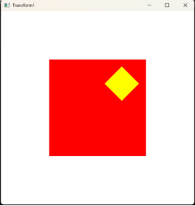
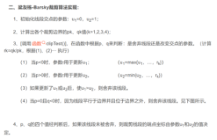

**图形学实验报告**

## **实验0**
glColor3f(1.0f, 1.0f, 0.0f); // 设置线条颜色为黄色

glBegin(GL\_LINES);           // 开始定义线段

glVertex2f(0.4f, 0.25f);     // 线条起点坐标

glVertex2f(-0.4f, 0.25f);    // 线条终点坐标

glEnd();                     // 结束定义线段

glBegin(GL\_LINES);       // 开始定义线段

glVertex2f(0.4f, 0.25f); // 线条起点坐标

glVertex2f(0.0f, -0.5f); // 线条终点坐标

glEnd();                 // 结束定义线段

glBegin(GL\_LINES);        // 开始定义线段

glVertex2f(0.0f, -0.5f);  // 线条终点坐标

glVertex2f(-0.4f, 0.25f); // 线条终点坐标

glEnd();                  // 结束定义线段

## **实验1**

Bresenham算法十分高效，推导过程是摘自https://blog.csdn.net/qq\_41883085/article/details/102706471

void DDALine(int x0, int y0, int x1, int y1) {

`    `int ddx = x1 - x0, ddy = y1 - y0;

`    `int dm = (fabs(ddx) > fabs(ddy)) ? fabs(ddx) : fabs(ddy);

`    `float dx = (float)ddx / (float)dm, dy = (float)ddy / (float)dm;

`    `float x = x0, y = y0;

`    `glBegin(GL\_POINTS);

`    `for (int i = 0; i <= dm; i++) {

`        `glVertex2f(int(x+0.5), (int)(y+0.5));

`        `x += dx;

`        `y += dy;

`    `}

`    `glEnd();

}

void swap\_value(int& a, int& b) {

`    `int tmp = a;

`    `a = b;

`    `b = tmp;

}

// 改进的Bresenham算法画线

void improvedBresenhamLine(int x0, int y0, int x1, int y1) {

`    `int dx, dy, d, UpIncre, DownIncre, x, y;

`    `if (x0 > x1) {

`        `swap\_value(x0, x1); swap\_value(y0, y1);

`    `}

`    `x = x0, y = y0;

`    `int xx = x1, yy = y1;

`    `dx = x1 - x0, dy = y1 - y0;

`    `bool flag = true;

`    `if (dx < dy) {

`        `flag = false;

`        `swap\_value(x, y);

`        `swap\_value(dx, dy);

`        `swap\_value(xx, yy);

`    `}

`    `d = dx - 2 \* dy;

`    `UpIncre = 2 \* dx - 2 \* dy;

`    `DownIncre = -2 \* dy;

`    `glBegin(GL\_POINTS);

`    `while (x <= xx) {

`        `if (flag)

`            `glVertex2d(x, y);

`        `else glVertex2d(y, x);

`        `x++;

`        `if (d < 0) {

`            `y++;

`            `d += UpIncre;

`        `}

`        `else

`            `d += DownIncre;

`    `}

`    `glEnd();

}

做到这里，我想到代码有很多可以复用，就把他们整合了

类似声明函数

void myDisplay0(void);

void myDisplay2();

void myDisplay3();

void myDisplay4();

void myDisplay5();

void keyboard3(unsigned char key, int x, int y);

void keyboard5(unsigned char key, int x, int y);

void mouse3(int button, int state, int x, int y);

void mouse4(int button, int state, int x, int y);

void mouse5(int button, int state, int x, int y);

void createMenu();

void init5();

int main(int argc, char\*\* argv) {

`    `glutInit(&argc, argv);

`    `glutInitDisplayMode(GLUT\_SINGLE | GLUT\_RGB);

`    `glutInitWindowSize(500, 500);

`    `glutInitWindowPosition(100, 100);

`        `int n;

`        `std::cin >> n;

`        `switch (n)

`        `{

`        `case 0:

`        `{

`            `glutCreateWindow("Hello OpenGL!"); // 创建一个标题为“Hello OpenGL!”的新窗口

`            `glutDisplayFunc(&myDisplay0);        // 注册绘图回调函数，指定当窗口需要重绘时调用myDisplay函数

`            `//glutReshapeFunc(Reshape);

`            `break;

`        `}

`        `case 1:

`        `{

`            `glutCreateWindow("Lines!");

`            `glutDisplayFunc(&myDisplay1);

`            `// Register reshape callback

`            `//glutReshapeFunc(Reshape);

`            `break;

`        `}

`        `case 2:

`        `{

`            `glutCreateWindow("Transform!");

`            `glutDisplayFunc(&myDisplay2);

`            `// Register reshape callback

`            `//glutReshapeFunc(Reshape);

`            `break;

`        `}

`        `case 3:

`        `{

`            `glutCreateWindow("Cut");

`            `glutDisplayFunc(&myDisplay3);

`            `glutKeyboardFunc(keyboard3);

`            `glutMouseFunc(mouse3);  // 注册鼠标回调

`            `glClearColor(0.0f, 0.0f, 0.0f, 1.0f);

`            `glMatrixMode(GL\_PROJECTION);

`            `glLoadIdentity();

`            `gluOrtho2D(-1.0, 1.0, -1.0, 1.0);

`            `break;

`        `}

`        `case 4:

`        `{

`            `glutCreateWindow("Bezier Curve Experiment");

`            `glClearColor(0.0, 0.0, 0.0, 0.0); // 设置背景颜色为黑色

`            `glColor3f(1.0, 1.0, 1.0);         // 设置绘图颜色为白色

`            `glPointSize(5.0);                 // 设置点大小

`            `gluOrtho2D(-10.0, 10.0, -10.0, 10.0); // 设置坐标系范围

`            `glutDisplayFunc(&myDisplay4);

`            `glutMouseFunc(mouse4);

`            `break;

`        `}

`        `case 5: {

`            `glutCreateWindow("Experiment Finish! Interactive Drawing System");

`            `init5(); // 初始化OpenGL设置

`            `createMenu(); // 创建右键菜单

`            `glutDisplayFunc(&myDisplay5); // 注册显示回调

`            `glutMouseFunc(mouse5);       // 注册鼠标回调

`            `glutKeyboardFunc(keyboard5);

`            `break;

`        `}

`        `default:

`            `break;

`        `}

`        `glutMainLoop();

`    `return 0;

}

给编程提升了一点点难度，但这样做能优化代码，后面还做了头文件

## **实验2**
其实没太看懂这个矩阵怎么用

Ai提供的转换方式倒也简单粗暴

其实不必太纠结于语法，图形学不止有OpenGL，更何况我们用的版本还比较老

以下代码只放出函数方法，主函数会调用他们

void drawSquare() { // 绘制中心在原点，边长为2的正方形

`    `glBegin(GL\_POLYGON);

`    `glVertex2f(-0.5f, -0.5f); // 左下角顶点

`    `glVertex2f(0.5f, -0.5f); // 右下角顶点

`    `glVertex2f(0.5f, 0.5f);  // 右上角顶点

`    `glVertex2f(-0.5f, 0.5f); // 左上角顶点

`    `glEnd();

}

void myDisplay2() {

`    `glClear(GL\_COLOR\_BUFFER\_BIT);

`    `glColor3f(1.0f, 1.0f, 1.0f);       // 设置当前绘制颜色为白色（RGB）

`    `glRectf(-1.5f, -1.5f, 1.5f, 1.5f); // 绘制一个矩形，中心在原点，边长为1个单位长度

`    `//drawLineDDA(0.4, 0.25, -0.4, 0.25);

`    `// 重置当前矩阵为单位矩阵

`    `glLoadIdentity();

`    `glColor3f(1.0, 0.0, 0.0);     // 设置绘制颜色为红色

`    `drawSquare();                 // 调用绘制正方形的函数

`    `// 应用平移变换

`    `glScalef(0.25f, 0.25f, 1.0f);        // 缩放到原来的一半大小

`    `glTranslatef(1.0, 1.0, 0.0);

`    `glRotatef(45.0f, 0.0f, 0.0f, 1.0f); // 绕Z轴逆时针旋转45度

`    `glColor3f(1.0, 1.0, 0.0);     // 设置绘制颜色为yellow

`    `drawSquare();                 // 调用绘制正方形的函数

`    `// 应用旋转变换 (角度, x轴分量, y轴分量, z轴分量)

`    `//glRotatef(theta, vx, vy, vz);

`    `// 应用缩放变换

`    `//glScalef(sx, sy, sz);

`    `// 绘制你的物体...

`    `glFlush();

}

void transForm() {      //used by experiment5

`    `//glLoadIdentity();

`    `glScalef(0.25f, 0.25f, 1.0f);        // 缩放到原来的1/4大小

`    `//glTranslatef(1.0, 1.0, 0.0);

`    `//glRotatef(45.0f, 0.0f, 0.0f, 1.0f); // 绕Z轴逆时针旋转45度

`    `glColor3f(1.0, 1.0, 0.0);     // 设置绘制颜色为yellow

}

## **实验3**
这个我简单跟网上的算法推到了一下草图

// Cohen-Sutherland裁剪算法

bool cohenSutherlandClip(float &x1, float &y1, float &x2, float &y2)

{

`    `int outcode1 = computeOutCode(x1, y1);

`    `int outcode2 = computeOutCode(x2, y2);

`    `bool accept = false;

`    `while (true)

`    `{

`        `if (!(outcode1 | outcode2))

`        `{

`            `// 两端点均在窗口内,简取

`            `accept = true;

`            `break;

`        `}

`        `else if (outcode1 & outcode2)

`        `{

`            `// 两端点均在窗口外，简弃

`            `break;

`        `}

`        `else

`        `{

`            `// 至少有一个端点在窗口外

`            `float x, y;

`            `int outcodeOut = outcode1 ? outcode1 : outcode2; // 取在窗口外的

`            `if (outcodeOut & 8)

`            `{ // TOP

`                `x = x1 + (x2 - x1) \* (ymax - y1) / (y2 - y1);

`                `y = ymax;

`            `}

`            `else if (outcodeOut & 4)

`            `{ // BOTTOM

`                `x = x1 + (x2 - x1) \* (ymin - y1) / (y2 - y1);

`                `y = ymin;

`            `}

`            `else if (outcodeOut & 2)

`            `{ // RIGHT

`                `y = y1 + (y2 - y1) \* (xmax - x1) / (x2 - x1);

`                `x = xmax;

`            `}

`            `else if (outcodeOut & 1)

`            `{ // LEFT

`                `y = y1 + (y2 - y1) \* (xmin - x1) / (x2 - x1);

`                `x = xmin;

`            `}

`            `if (outcodeOut == outcode1)

`            `{

`                `x1 = x;

`                `y1 = y;

`                `outcode1 = computeOutCode(x1, y1);

`            `}

`            `else

`            `{

`                `x2 = x;

`                `y2 = y;

`                `outcode2 = computeOutCode(x2, y2);

`            `}

`        `}

`    `}

`    `return accept;

}

https://blog.csdn.net/hxianxian/article/details/8447853

根据中文伪代码写就好

// 梁友栋裁剪算法

bool liangBarskyClip(float& x1, float& y1, float& x2, float& y2) {

`    `float dx = x2 - x1, dy = y2 - y1;

`    `float t0 = 0.0f, t1 = 1.0f;

`    `float p[4] = { -dx, dx, -dy, dy };

`    `float q[4] = { x1 - xmin, xmax - x1, y1 - ymin, ymax - y1 };

`    `for (int i = 0; i < 4; ++i) {

`        `if (p[i] == 0) {

`            `if (q[i] < 0) return false;  // 平行并在边界外

`        `}

`        `else {

`            `float t = q[i] / p[i];

`            `if (p[i] < 0) {

`                `t0 = std::max(t0, t);  // 进入点

`            `}

`            `else {

`                `t1 = std::min(t1, t);  // 离开点

`            `}

`        `}

`    `}

`    `if (t0 > t1) return false;  // 直线在窗口外，不可见

`    `x2 = x1 + t1 \* dx;

`    `y2 = y1 + t1 \* dy;

`    `x1 = x1 + t0 \* dx;

`    `y1 = y1 + t0 \* dy;

`    `return true;

}

这里还有一个完整详细的操作流程控制（我是抄朋友的）

// 键盘回调函数

void keyboard3(unsigned char key, int x, int y) {

`    `switch (key) {

`    `case '1':  // 选择Cohen-Sutherland算法

`        `currentAlgorithm = 1;

`        `std::cout << "Selected: Cohen-Sutherland Algorithm\n";

`        `printf("Press key 'c' to Clip!\nPress key 'r' to Restore!\n");

`        `break;

`    `case '2':  // 选择梁友栋算法

`        `currentAlgorithm = 2;

`        `std::cout << "Selected: Liang-Barsky Algorithm\n";

`        `printf("Press key 'c' to Clip!\nPress key 'r' to Restore!\n");

`        `break;

`    `case 'c':  // 执行裁剪

`        `isClipped = true;

`        `break;

`    `case 'r':  // 复原原始直线

`        `isClipped = false;

`        `break;

`    `case 27:  // 按ESC退出

`        `exit(0);

`    `default:

`        `break;

`    `}

`    `glutPostRedisplay();  // 请求重新渲染

}

// 鼠标回调函数

void mouse3(int button, int state, int x, int y) {

`    `if (button == GLUT\_LEFT\_BUTTON && state == GLUT\_DOWN) {

`        `// 将窗口坐标转换为OpenGL坐标

`        `float wx = (x - 250.0f) / 250.0f; // 假设窗口大小为500x500

`        `float wy = (250.0f - y) / 250.0f; // 翻转Y轴

`        `if (!isFirstPointSet) {

`            `// 第一次点击设置起点

`            `mouseX1 = wx;

`            `mouseY1 = wy;

`            `isFirstPointSet = true;

`        `}

`        `else {

`            `// 第二次点击设置终点并重置标志位

`            `mouseX2 = wx;

`            `mouseY2 = wy;

`            `isFirstPointSet = false;

`            `// 更新当前绘制的直线的起点和终点

`            `X1 = mouseX1;

`            `Y1 = mouseY1;

`            `X2 = mouseX2;

`            `Y2 = mouseY2;

`            `printf("Press key '1' to select: Cohen-Sutherland Algorithm\nPress key '2' to select: Liang-Barsky Algorithm\n");

`            `// 请求重新渲染

`            `glutPostRedisplay();

`        `}

`    `}

}

渲染函数

void myDisplay3() {

`    `glClear(GL\_COLOR\_BUFFER\_BIT);

`    `// 绘制裁剪窗口

`    `glColor3f(1.0f, 0.0f, 0.0f);  // 红色

`    `glBegin(GL\_LINE\_LOOP);

`    `glVertex2f(xmin, ymin);

`    `glVertex2f(xmax, ymin);

`    `glVertex2f(xmax, ymax);

`    `glVertex2f(xmin, ymax);

`    `glEnd();

`    `// 绘制当前直线

`    `if (isClipped) {

`        `float x1\_clipped = X1, y1\_clipped = Y1;

`        `float x2\_clipped = X2, y2\_clipped = Y2;

`        `bool visible = false;

`        `if (currentAlgorithm == 1) {

`            `visible = cohenSutherlandClip(x1\_clipped, y1\_clipped, x2\_clipped, y2\_clipped);

`        `}

`        `else if (currentAlgorithm == 2) {

`            `visible = liangBarskyClip(x1\_clipped, y1\_clipped, x2\_clipped, y2\_clipped);

`        `}

`        `if (visible) {

`            `glColor3f(0.0f, 1.0f, 0.0f);  // 绿色表示裁剪后的直线

`            `glBegin(GL\_LINES);

`            `glVertex2f(x1\_clipped, y1\_clipped);

`            `glVertex2f(x2\_clipped, y2\_clipped);

`            `glEnd();

`        `}

`    `}

`    `else {

`        `glColor3f(0.0f, 0.0f, 1.0f);  // 蓝色表示原始直线

`        `glBegin(GL\_LINES);

`        `glVertex2f(X1, Y1);

`        `glVertex2f(X2, Y2);

`        `glEnd();

`    `}

`    `glFlush();

}

## **实验4**
把这个式子推导出来

这曲线太美了，代码太优雅了！

代码实现

// Calculate the points on the Bezier curve

void calcBezierCurve(std::vector<Point>& curvePoints, const std::vector<Point>& controlPoints) {

`    `int numPoints = 100; // Number of points on the curve

`    `curvePoints.clear();

`    `for (int i = 0; i <= numPoints; ++i) {

`        `float t = static\_cast<float>(i) / numPoints;

`        `Point p(

`            `pow(1 - t, 3) \* controlPoints[0].x +

`            `3 \* pow(1 - t, 2) \* t \* controlPoints[1].x +

`            `3 \* (1 - t) \* pow(t, 2) \* controlPoints[2].x +

`            `pow(t, 3) \* controlPoints[3].x,

`            `pow(1 - t, 3) \* controlPoints[0].y +

`            `3 \* pow(1 - t, 2) \* t \* controlPoints[1].y +

`            `3 \* (1 - t) \* pow(t, 2) \* controlPoints[2].y +

`            `pow(t, 3) \* controlPoints[3].y

`        `);

`        `curvePoints.push\_back(p);

`    `}

}

// Display function to render the control points and Bezier curve

void myDisplay4() {

`    `glClear(GL\_COLOR\_BUFFER\_BIT);

`    `if (!controlPoints.empty()) {

`        `glColor3f(1.0, 1.0, 1.0); // Set control points color to white

`        `glBegin(GL\_POINTS);

`        `for (const auto& point : controlPoints) {

`            `glVertex2f(point.x, point.y);

`        `}

`        `glEnd();

`        `if (controlPoints.size() == 4 && bDraw) {

`            `std::vector<Point> curvePoints;

`            `calcBezierCurve(curvePoints, controlPoints);

`            `glColor3f(1.0, 0.0, 0.0); // Set Bézier curve color to red

`            `glBegin(GL\_LINE\_STRIP);

`            `for (const auto& point : curvePoints) {

`                `glVertex2f(point.x, point.y);

`            `}

`            `glEnd();

`        `}

`    `}

`    `glFlush();

`    `//glutSwapBuffers();

}

// Mouse event handling function

void mouse4(int button, int state, int x, int y) {

`    `if (button == GLUT\_LEFT\_BUTTON && state == GLUT\_DOWN) {

`        `if (controlPoints.size() < 4) {

`            `// Convert screen coordinates to world coordinates

`            `int windowWidth = glutGet(GLUT\_WINDOW\_WIDTH);

`            `int windowHeight = glutGet(GLUT\_WINDOW\_HEIGHT);

`            `float worldX = (static\_cast<float>(x) / windowWidth) \* 20.0f - 10.0f;

`            `float worldY = 10.0f - (static\_cast<float>(y) / windowHeight) \* 20.0f;

`            `controlPoints.emplace\_back(worldX, worldY);

`            `if (controlPoints.size() == 4) {

`                `bDraw = true;

`            `}

`            `glutPostRedisplay();

`        `}

`    `}

}

头文件

#pragma once

#ifndef DRAWING\_H

#define DRAWING\_H

#include <vector>

// 点结构体定义

struct Point {

`    `float x, y;

`    `Point(float x = 0.0f, float y = 0.0f) : x(x), y(y) {}

};

// 绘图模式枚举

enum DrawMode { NONE, LINE, TRIANGLE, SQUARE, BEZIER };

extern DrawMode currentMode;

extern std::vector<Point> controlPoints; // 声明外部变量

extern bool bDraw;

//void calcBezierCurve(std::vector<Point>& curvePoints, const std::vector<Point>& controlPoints);

#endif // DRAWING\_H

其实这个头文件可以封装的再好一点，当时也是临时想到能用头文件

## **实验5**
关键功能

右键菜单

// 菜单处理函数

void menu(int id) {

`    `switch (id) {

`    `case 1: currentMode = LINE; break;

`    `case 2: currentMode = TRIANGLE; break;

`    `case 3: currentMode = SQUARE; break;

`    `case 4: currentMode = BEZIER; break;

`    `default: currentMode = NONE; break;

`    `}

`    `glutPostRedisplay();

}

// 创建菜单

void createMenu() {

`    `int menuId = glutCreateMenu(menu);

`    `glutAddMenuEntry("Line", 1);

`    `glutAddMenuEntry("Triangle", 2);

`    `glutAddMenuEntry("Square", 3);

`    `glutAddMenuEntry("Bezier Curve", 4);

`    `glutAttachMenu(GLUT\_RIGHT\_BUTTON);

}

进入鼠标响应

// 鼠标事件处理函数

void mouse5(int button, int state, int x, int y) {

`    `if (button == GLUT\_LEFT\_BUTTON && state == GLUT\_DOWN) {

`        `int windowWidth = glutGet(GLUT\_WINDOW\_WIDTH);

`        `int windowHeight = glutGet(GLUT\_WINDOW\_HEIGHT);

`        `Point point(20.0f \* (static\_cast<float>(x) / windowWidth) - 10.0f,

`            `10.0f - 20.0f \* (static\_cast<float>(y) / windowHeight));

`        `switch (currentMode) {

`        `case LINE:

`            `if (controlPoints5.size() < 2) {

`                `controlPoints5.push\_back(point);

`                `if (controlPoints5.size() == 2) bDraw5 = true;

`            `}

`            `break;

`        `case TRIANGLE:

`            `if (controlPoints5.size() < 3) {

`                `controlPoints5.push\_back(point);

`                `if (controlPoints5.size() == 3) bDraw5 = true;

`            `}

`            `break;

`        `case SQUARE:

`            `if (controlPoints5.empty()) {

`                `controlPoints5.push\_back(point);

`                `bDraw5 = true;

`            `}

`            `break;

`        `case BEZIER:

`            `if (controlPoints5.size() < 4) {

`                `controlPoints5.push\_back(point);

`                `if (controlPoints5.size() == 4) bDraw5 = true;

`            `}

`            `break;

`        `default: break;

`        `}

`        `glutPostRedisplay();

`    `}

}

键盘响应

按’t’后边长缩小1/4

按‘3’切换Cut窗口并能实现裁剪

按’s’保存文件

void keyboard5(unsigned char key, int x, int y) {

`    `switch (key) {

`    `case 'c': // 清空控制点

`        `controlPoints5.clear();

`        `bDraw5 = false;

`        `glutPostRedisplay();

`        `break;

`    `case 'r': // 重置模式

`        `currentMode = NONE;

`        `controlPoints5.clear();

`        `bDraw5 = false;

`        `glutPostRedisplay();

`        `break;

`    `case 't':

`        `transForm();

`        `//bDraw5 = false;

`        `glutPostRedisplay();

`        `break;

`    `case '3': {

`        `//glClear(GL\_COLOR\_BUFFER\_BIT);

`        `//glColor3f(1.0f, 0.0f, 0.0f);  // 红色

`        `//glBegin(GL\_LINE\_LOOP);

`        `//glVertex2f(xmin, ymin);

`        `//glVertex2f(xmax, ymin);

`        `//glVertex2f(xmax, ymax);

`        `//glVertex2f(xmin, ymax);

`        `//glEnd();

`        `//glFlush();

`        `//glutPostRedisplay();

`        `glutInitWindowSize(500, 500);

`        `glutInitWindowPosition(100, 100);

`        `glutCreateWindow("Cut");

`        `glutDisplayFunc(&myDisplay3);

`        `glutKeyboardFunc(keyboard3);

`        `glutMouseFunc(mouse3);  // 注册鼠标回调

`        `glClearColor(0.0f, 0.0f, 0.0f, 1.0f);

`        `glMatrixMode(GL\_PROJECTION);

`        `glLoadIdentity();

`        `gluOrtho2D(-1.0, 1.0, -1.0, 1.0);

`        `break;

`    `}

`    `case 's':

`        `saveToFile("drawing.txt"); break;

`    `default:

`        `break;

`    `}

}

枚举类放在头文件里了，变换是调用实验二的变换函数

void transForm() {      //used by experiment5

`    `//glLoadIdentity();

`    `glScalef(0.25f, 0.25f, 1.0f);        // 缩放到原来的1/4大小

`    `//glTranslatef(1.0, 1.0, 0.0);

`    `//glRotatef(45.0f, 0.0f, 0.0f, 1.0f); // 绕Z轴逆时针旋转45度

`    `glColor3f(1.0, 1.0, 0.0);     // 设置绘制颜色为yellow

}

不知道为啥加了单位矩阵反而有bug

裁剪功能的话，因为多边形裁剪代码实现超级复杂（真正原因：懒！我太懒了，真的）

所以只弄直线的裁剪，那直接调用实验三的窗口不就好了，大道至简！

然后贝塞尔曲线也塞到菜单里了

存取文件的功能的话是可以运行的，但是读取不了文件流，具体的格式没搞明白，但老师说这个功能不重要，毕竟，我是懒狗嘛

void saveToFile(const char\* filename) {

`    `std::ofstream file(filename);

`    `if (!file.is\_open()) {

`        `std::cout << "无法打开文件进行写入: " << filename << std::endl;

`        `return;

`    `}

`    `// 写入绘图模式

`    `file << static\_cast<int>(currentMode) << "\n";

`    `// 写入控制点

`    `for (const auto& point : controlPoints) {

`        `file << point.x << " " << point.y << "\n";

`    `}

`    `file.close();

}

// 绘制函数

void myDisplay5() {

`    `glClear(GL\_COLOR\_BUFFER\_BIT);

`    `if (!controlPoints5.empty()) {

`        `glColor3f(1.0, 1.0, 1.0); // 控制点颜色

`        `glBegin(GL\_POINTS);

`        `for (const auto& point : controlPoints5) {

`            `glVertex2f(point.x, point.y);

`        `}

`        `glEnd();

`        `if (bDraw5) {

`            `switch (currentMode) {

`            `case LINE:

`                `if (controlPoints5.size() == 2) {

`                    `glColor3f(1.0, 0.0, 0.0); // 线条颜色

`                    `glBegin(GL\_LINES);

`                    `glVertex2f(controlPoints5[0].x, controlPoints5[0].y);

`                    `glVertex2f(controlPoints5[1].x, controlPoints5[1].y);

`                    `glEnd();

`                `}

`                `break;

`            `case TRIANGLE:

`                `if (controlPoints5.size() == 3) {

`                    `glColor3f(0.0, 1.0, 0.0); // 三角形颜色

`                    `glBegin(GL\_TRIANGLES);

`                    `for (const auto& point : controlPoints5) {

`                        `glVertex2f(point.x, point.y);

`                    `}

`                    `glEnd();

`                `}

`                `break;

`            `case SQUARE:

`                `if (!controlPoints5.empty()) {

`                    `glColor3f(0.0, 0.0, 1.0); // 正方形颜色

`                    `Point topLeft = controlPoints5[0];

`                    `Point bottomRight = controlPoints5[0];

`                    `glBegin(GL\_QUADS);

`                    `glVertex2f(topLeft.x, topLeft.y);

`                    `glVertex2f(bottomRight.x + 2, topLeft.y);

`                    `glVertex2f(bottomRight.x + 2, bottomRight.y - 2);

`                    `glVertex2f(topLeft.x, bottomRight.y - 2);

`                    `glEnd();

`                `}

`                `break;

`            `case BEZIER:

`                `if (controlPoints5.size() == 4) {

`                    `std::vector<Point> curvePoints;

`                    `calcBezierCurve(curvePoints, controlPoints5);

`                    `glColor3f(1.0, 0.0, 0.0); // Bezier曲线颜色

`                    `glBegin(GL\_LINE\_STRIP);

`                    `for (const auto& point : curvePoints) {

`                        `glVertex2f(point.x, point.y);

`                    `}

`                    `glEnd();

`                `}

`                `break;

`            `default: break;

`            `}

`        `}

`    `}

`    `glFlush();

}

